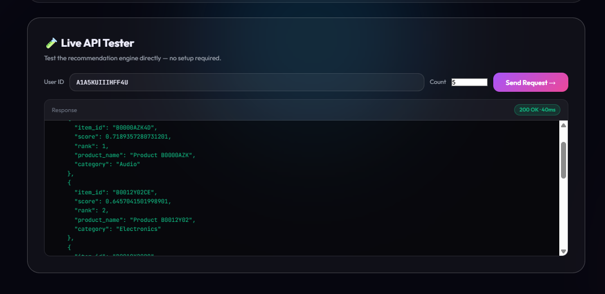
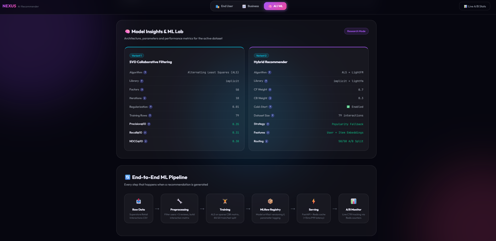
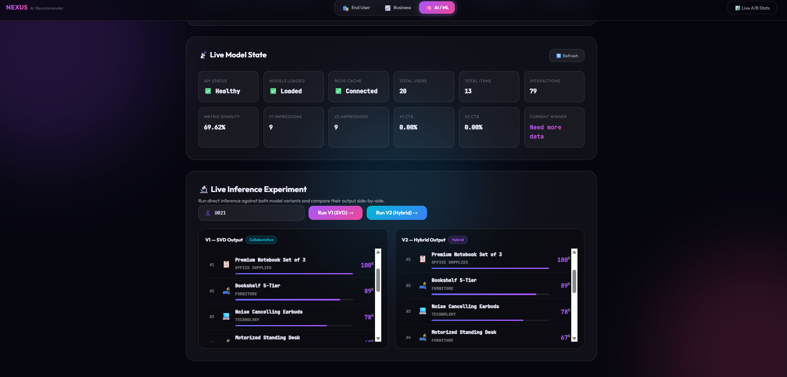

# NEXUS AI Recommender

## 📖 About the Project
Nexus is an AI-powered product recommendation platform featuring live A/B testing, real-time analytics, and multi-persona tools tailored for shoppers, merchants, and data scientists. It provides a complete end-to-end pipeline from exploring raw synthetic datasets to serving real-time collaborative filtering and hybrid recommendation models via a lightning-fast API.

## ✨ Features

### 🛍️ End User Experience
Shoppers receive tailored product recommendations with a beautiful, dynamic interface, allowing them to discover their next obsession seamlessly.


### 💼 Business & Integration
For merchants and developers, Nexus provides a simple 3-step integration process to fetch personalized recommendations, track customer clicks (A/B Signals), and monitor live A/B dashboards.


Test the recommendation engine directly with no setup required using the built-in Live API Tester.


### 🧠 AI / ML & Data Science
Data scientists get a dedicated suite of tools to peek under the hood of the recommendation engine.

**1. Dataset Exploration & Pandas Integration**
View the raw synthetic datasets or upload custom CSVs. Dive deeper into the data by running live Pandas DataFrame methods (like `df.describe()` and `df.info()`) directly from the dashboard.


**2. Model Insights & ML Lab**
Review side-by-side architecture parameters and offline performance metrics (Precision, Recall, NDCG) for each model variant. Visualize the end-to-end ML pipeline journey from raw data to Redis caching.


**3. Live State & Inference Experimentation**
Monitor the live state of the API, cache health, and real-time A/B testing CTR. Run direct inference experiments by entering any user ID to see both models (SVD vs Hybrid) return tailored product recommendations side-by-side.


## 🚀 How to Run the Project

1. **Clone the Repository**
   ```bash
   git clone <your-github-repo-url>
   cd product-recommender
   ```

2. **Run with Docker Compose**
   Ensure you have [Docker](https://www.docker.com/) installed and running on your system, then start the application:
   ```bash
   docker compose up -d --build
   ```

3. **Access the Dashboard**
   Open your browser and navigate to:
   [http://localhost:8000](http://localhost:8000)